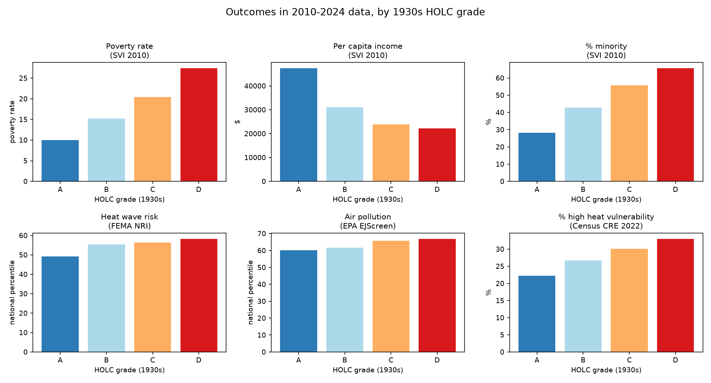
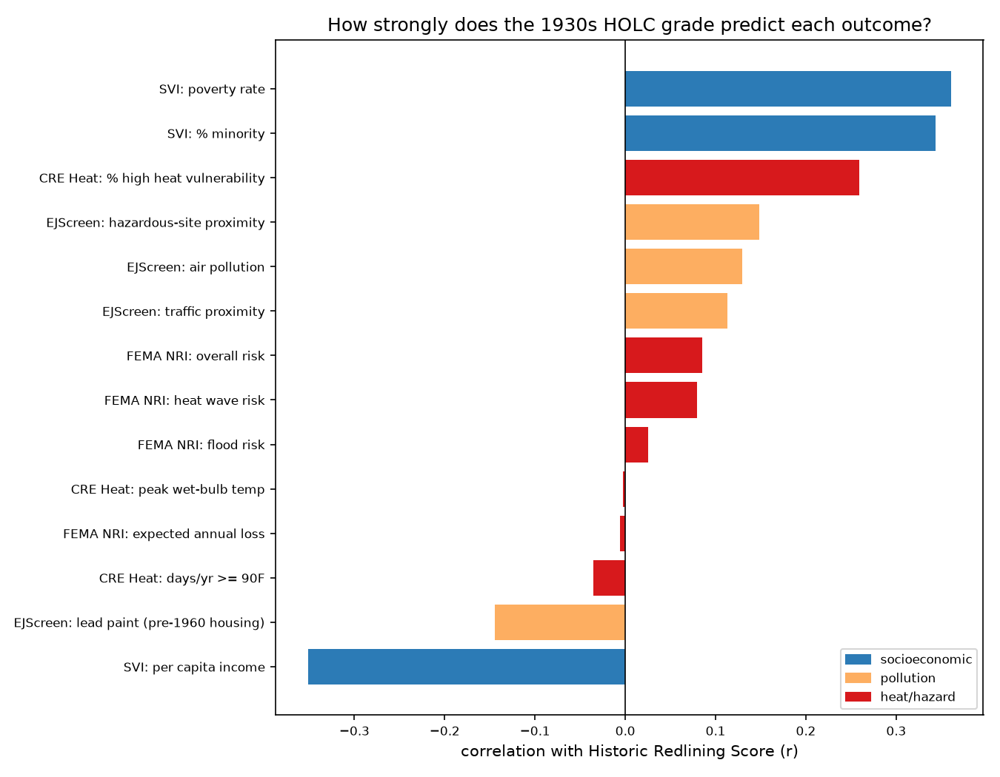

# Redline Echo

Redlining (HOLC) vs. present-day socioeconomic outcomes: joins the
official 1930s HOLC redlining grades to 2010 census tracts and looks
at how poverty, income, and racial composition in those same tracts
looked ~70 years later, per the 2010 CDC/ATSDR Social Vulnerability
Index — the 1937 map decisions still echoing in the 2010 data, decades
after the Fair Housing Act (1968) outlawed redlining.

This project underlies a manuscript, "Historical Redlining and
Present-Day Urban Inequality: A Reproducible Multi-Instrument Audit
Using Open Government Data," submitted to *Environment and Planning B:
Urban Analytics and City Science* (Sage) and currently under review.
The manuscript audits the same claim this repository tests: whether
1930s HOLC redlining still predicts present-day socioeconomic and
environmental outcomes, joined across six independent government
datasets rather than trusting a single source or the literature's
causal story on its own.




*(Both regenerated by `visualize.py` — see "Charts" below. The second
chart is the one-picture summary of everything in this README: the
socioeconomic gap (blue) is the strongest signal by far; the heat/hazard
measures (red) mostly cluster near zero except the population
vulnerability composite; pollution/proximity (orange) sits in between.)*

## What this DOES show

A real, verifiable, monotonic relationship: tracts historically graded
"D" (Hazardous) by HOLC are, in 2010 data:
- **2.75x** poorer (27.4% vs. 10.0% poverty rate) than "A"-graded tracts
- earning **47%** as much per capita ($22,183 vs. $47,454)
- more concentrated with racial/ethnic minority residents (65.7% vs. 28.2%)

...more than 40 years after redlining was outlawed (Fair Housing Act,
1968) and ~70 years after the maps were drawn. Correlation between the
continuous Historic Redlining Score and these outcomes is moderate
(r ≈ 0.34–0.36) — real, but far from deterministic. Many "D" tracts are
not poor today; many "A" tracts are. See Shreevastava et al. 2025
(cited in the manuscript) for why: present-day investment can and does
change outcomes independent of the historical grade.

## Is this discrimination?

Two separate claims, often conflated, are worth pulling apart:

1. **The 1930s grading was explicitly discriminatory by design, not just in
   effect.** This isn't inferred from the data below — it's documented in
   the historical record. HOLC's own area-description methodology directed
   assessors to record a neighborhood's racial and immigrant composition,
   and treated the presence of Black, Jewish, or immigrant residents as a
   negative factor that could push a grade down to "C" or "D" regardless of
   the physical housing stock. This is established by historians working
   directly from the original HOLC records (the same underlying source as
   the crosswalk used here) — see Jackson, *Crabgrass Frontier* (1985) and
   Rothstein, *The Color of Law* (2017); the Mapping Inequality project
   (Nelson et al., cited above) documents it directly from the scanned
   HOLC area-description forms. So the grade variable used throughout this
   project (`HRS`/`dominant_grade`) is not a neutral risk score that
   happened to correlate with race — race was one of the inputs.
2. **Whether today's gap is still driven by that same mechanism, or by
   something else entirely, is an empirical question** — and the one this
   project can actually test with real data. The regression checks below
   ask specifically whether the historic grade still predicts 2010
   outcomes *after* accounting for a tract's current racial composition
   and its state. If the grade's effect vanished once you control for
   today's demographics, that would suggest the "gap" is really just
   today's segregation restated. It doesn't vanish (see "Statistical
   robustness"): the historic grade keeps independent predictive power,
   consistent with a durable, place-based effect — most plausibly
   decades of investment, lending, and zoning decisions that tracked the
   original grade — separate from whoever happens to live there today.

Neither point makes this a causal, individual-level claim ("this specific
person was discriminated against because of this specific grade"). Both
together are why "echo" is the right word for what's in this repo: a
documented discriminatory input, and a measurable, statistically robust
signal of it 80-90 years later.

## What this DOES NOT show

**This started as mostly socioeconomic data (poverty, income, race), not
physical climate/environmental data** — that's no longer fully true (see
"Climate risk: FEMA National Risk Index", "Environmental quality: EPA
EJScreen", and "Direct heat exposure: Census Community Resilience
Estimates" below). The published papers this manuscript relies on
(Hoffman, Shandas & Pendleton 2020; Salazar-Miranda et al. 2024)
establish the second half of the causal chain for heat and flood — that
socioeconomic sorting translates into measurably higher heat and flood
exposure via reduced tree canopy, more impervious surface, and less
drainage investment, using fine-grained satellite/city-level
measurements. A parallel literature (Lane et al. 2022) documents the
same redlining-to-present-day-disparity pattern for air pollution
specifically, not heat or flood. This project's own attempts at these
links, using three different national datasets, find real but
*inconsistent-strength* signals — strong for pollution/vulnerability,
weak to none for raw natural-hazard risk and physical heat-day counts —
see those sections for the numbers and why the differences likely trace
to what each dataset actually measures (national risk-index composites
and climate-zone-driven heat-day counts vs. policy-driven siting and
population vulnerability), rather than the underlying literature being
wrong. The still-missing piece is a direct, within-city land-surface-
temperature comparison — see "Extending this".

This is also **correlational, not causal**, at the tract level (unlike
Salazar-Miranda et al. 2024's boundary-discontinuity design, which
compares near-identical properties on opposite sides of a HOLC
boundary line — a much stronger design than the simple grouped means
computed here).

## Data sources

| Dataset | Source | License/Attribution | Vintage |
|---|---|---|---|
| HOLC grades → 2010 census tract crosswalk | [American Panorama / Mapping Inequality](https://dsl.richmond.edu/panorama/redlining/), mirrored at `github.com/americanpanorama/mapping-inequality-census-crosswalk` | Nelson, Robert K., et al., Digital Scholarship Lab, University of Richmond. CC BY-NC-SA 4.0 | 2010 tracts |
| Social Vulnerability Index (poverty, income, minority %) | CDC/ATSDR SVI 2010, mirrored at `github.com/lpiep/cdc-svi` (original: `svi.cdc.gov`) | Public domain, U.S. government work | 2010 tracts |

Both files are large (HOLC GeoJSON ~67MB, SVI CSV ~55MB); `download_data.py`
fetches them fresh rather than bundling them.

## Methodology

1. Flatten the HOLC GeoJSON's `features[].properties` into a table:
   `area_id, city, state, grade, GEOID10, pct_tract`. `pct_tract` is the
   fraction of a 2010 census tract covered by that HOLC polygon (tracts
   can span multiple HOLC-graded areas).
2. Keep only standard grades A/B/C/D (drop rare/nonstandard "E"/"F" and
   blank grades — 51,866 raw records → 43,257 clean records).
3. For each tract, compute:
   - **Historic Redlining Score (HRS)**: area-weighted mean of grade
     (A=1 … D=4), following the approach used in Meier & Mitchell
     (2021), the crosswalk source cited by Salazar-Miranda et al. (2024).
   - **Dominant grade**: the single grade covering the largest area
     share of the tract, for simpler group comparisons.
4. Join to SVI 2010 on 11-digit tract FIPS (`GEOID10` = `FIPS`).
5. Compare group means (by dominant grade) and Pearson correlations
   (HRS vs. each outcome, continuous).

Result: 16,500 tracts had HOLC coverage; 16,372 of those also had valid
SVI data (some SVI records use -999 sentinel values for suppressed/
missing estimates and are dropped).

## Persistence over time (2010-2022)

The CDC/ATSDR mirror used here (`lpiep/cdc-svi`) carries every published
SVI tract vintage, not just 2010. `analyze_trends.py` re-runs the A-vs-D
comparison for each one:

| Year | Poverty definition | A poverty % | D poverty % | D/A ratio | A income | D income | A/D income ratio | HRS↔poverty r |
|---|---|---|---|---|---|---|---|---|
| 2010 | 100% FPL | 9.9 | 27.3 | 2.74 | $47,454 | $22,183 | 2.14 | 0.357 |
| 2014 | 100% FPL | 11.1 | 29.3 | 2.65 | $49,677 | $23,727 | 2.09 | 0.359 |
| 2016 | 100% FPL | 11.1 | 28.6 | 2.57 | $51,786 | $25,284 | 2.05 | 0.360 |
| 2018 | 100% FPL | 10.6 | 26.6 | 2.51 | $56,161 | $28,282 | 1.99 | 0.345 |
| 2020 | 150% FPL | 14.9 | 35.3 | 2.37 | — | — | — | 0.346 |
| 2022 | 150% FPL | 15.3 | 34.6 | 2.27 | — | — | — | 0.340 |

CDC/ATSDR redefined the poverty-rate variable in the 2020 redesign (100%
of the federal poverty line → 150%) and dropped per-capita income
entirely, so the pre/post-2020 rows aren't on an identical scale — that
redefinition, not a real-world jump, explains most of the 2018→2020 level
change. Within each definition era, though, the pattern is consistent:
the gap has been *narrowing slowly* (D/A poverty ratio 2.74 → 2.51 across
2010-2018; 2.37 → 2.27 across 2020-2022) while staying large, and the
HRS-poverty correlation is essentially flat (0.34-0.36) across all six
vintages spanning 12 years. This is not a one-year artifact of the 2010
snapshot in "What this DOES show" above.

## As current as the data gets: ACS 2020-2024

No government dataset covering anything close to 2026 exists yet for
these indicators — CDC/ATSDR's own SVI still tops out at 2022 (confirmed
directly against their current data-documentation page, not just the
GitHub mirror). The closest real substitute is the Census Bureau's
American Community Survey (ACS) 5-year estimates, vintage 2024 (i.e.
2020-2024 data, published 2025) — the most recent tract-level release
that exists. `analyze_acs.py` pulls it live from `api.census.gov`
(50 states + DC, poverty/income/race-ethnicity tables) and reruns the
same comparison:

|                | n tracts | poverty % | per capita income | % minority |
|---|---|---|---|---|
| A | 1,056 | 10.0 | $73,791 | 34.9 |
| B | 3,087 | 14.3 | $50,853 | 48.6 |
| C | 6,531 | 18.2 | $40,442 | 59.8 |
| D | 3,985 | 23.1 | $40,042 | 67.1 |

Poverty ratio D/A: 2.31x. Income ratio A/D: 1.84x. HRS↔poverty r = 0.304,
HRS↔income r = −0.276, HRS↔% minority r = 0.318 — the same monotonic
pattern as every SVI vintage above, still holding in the most current
tract data available, 90+ years after the maps were drawn.

Two caveats specific to this cross-check:

- Only 14,659 of the 16,500 HOLC-covered tracts matched (vs. 16,372 for
  2010 SVI). ACS 2020-2024 uses 2020 census tract boundaries; the HOLC
  crosswalk uses 2010 boundaries. Tracts that were split or merged in
  the 2020 redistricting don't share a GEOID across the two and get
  dropped by the join — the same boundary-drift issue CDC/ATSDR's own
  documentation notes for its 2020/2022 SVI releases.
- Needs a free Census API key (`https://api.census.gov/data/key_signup.html`)
  in the `CENSUS_API_KEY` environment variable — not bundled with this
  repo, and intentionally not committed anywhere in it.

## Statistical robustness

Group means and a bivariate correlation can both be driven by a
confound — e.g., if D grades happened to cluster in poorer states
regardless of redlining. `regression.py` runs OLS (heteroskedasticity-robust
SEs) on the 2010 merged data to check this:

| Outcome | Specification | HRS coefficient | p-value | R² |
|---|---|---|---|---|
| Poverty rate (%) | HRS only | +6.82 pts/grade | <1e-300 | 0.130 |
| Poverty rate (%) | + state fixed effects | +7.16 pts/grade | <1e-300 | 0.201 |
| Poverty rate (%) | + state FE + current minority % | +4.09 pts/grade | 2.6e-256 | 0.395 |
| Per capita income ($) | HRS only | −$7,809/grade | <1e-280 | 0.123 |
| Per capita income ($) | + state fixed effects | −$8,305/grade | <1e-300 | 0.176 |
| % minority (2010) | HRS only | +14.14 pts/grade | <1e-300 | 0.118 |
| % minority (2010) | + state fixed effects | +13.31 pts/grade | <1e-300 | 0.238 |

Two things stand out:

- Adding state fixed effects **doesn't shrink** the HRS coefficient — it
  grows slightly. The gap isn't an artifact of which states got more D
  grades; it holds comparing tracts within the same state.
- Adding today's minority % as a control cuts the poverty coefficient
  roughly in half (+6.8 → +4.1 points per grade step) but doesn't remove
  it, and it stays overwhelmingly significant. The historic grade is
  carrying real information about 2010 poverty beyond what today's racial
  composition alone explains — see "Is this discrimination?" above for
  why that matters.

This is still observational data: no instrument, no boundary-discontinuity
design (unlike Salazar-Miranda et al. 2024), and no control for other
plausible confounds (pre-1930s housing stock, density, distance to
downtown). It rules out "it's just states" and "it's just who lives there
now" as full explanations; it does not establish the specific causal
mechanism.

## Climate risk: FEMA National Risk Index

`hazards.fema.gov` and `www.fema.gov`'s own static-file downloads
returned 403 from every environment tried across this project — but
FEMA's National Risk Index (NRI) Census Tracts table is also published
as an open ArcGIS Hub dataset by `resilience.climate.gov` (US Climate
Resilience Toolkit), and that download endpoint isn't blocked.
`download_data.py` now fetches it from there; `analyze_climate.py` joins
it to the HOLC crosswalk on tract FIPS and compares FEMA's per-hazard
risk scores (0-100 national percentile) by dominant grade:

|                | n tracts | overall risk | expected annual loss | heat wave risk | flood risk |
|---|---|---|---|---|---|
| A | 1,090 | 37.85 | 41.40 | 49.30 | 29.07 |
| B | 3,170 | 36.98 | 35.65 | 55.41 | 22.16 |
| C | 6,740 | 38.69 | 34.55 | 56.29 | 22.17 |
| D | 4,064 | 44.02 | 38.30 | 58.33 | 28.82 |

HRS correlations: overall risk r = 0.085, expected annual loss r = −0.006,
heat wave risk r = 0.080, flood risk r = 0.025. Heat wave risk ratio D/A
is 1.18x; flood risk ratio D/A is 0.99x (essentially no difference).

**This is a real result, not a null finding to explain away: at this
granularity, the redlining-to-climate-risk link is weak to nonexistent**
— nothing like the r ≈ 0.30-0.36 seen for poverty, income, and racial
composition throughout this project. Two things are worth separating:

- FEMA's NRI is a *national*, multi-hazard, loss-weighted composite —
  `EAL_SCORE` and `RISK_SCORE` are dominated by total building/agricultural
  value and area exposure across 18 hazard types (including ones with no
  urban-heat-island mechanism at all, like drought and hurricane wind).
  It is not built to detect within-city microclimate differences.
- Hoffman, Shandas & Pendleton (2020) and Shreevastava et al. (2025)
  measure heat directly and locally — satellite land-surface temperature
  compared *within the same city*, at much finer spatial resolution, over
  the same summer days. A national tract-level percentile score is a
  coarser instrument and would be expected to miss a real, but
  intra-urban, effect.

So this doesn't contradict those papers' findings — it shows that FEMA's
NRI, specifically, isn't the right instrument to reproduce them with.
Getting a truly comparable measure back would need city-scoped land
surface temperature data (see "Extending this" below), not a national
FEMA-style risk index.

## Environmental quality: EPA EJScreen

EPA discontinued public access to EJScreen in February 2025, and
`epa.gov`/`gaftp.epa.gov` are unreachable the same way FEMA's own domains
are — but the same trick that worked for the NRI file applies again:
EPA's last-published EJScreen 2.32 tract data is re-hosted as an ArcGIS
item by a third party, straight from the official release (same
`ID`/`STATE_NAME`/indicator schema as EPA's own documentation).
`analyze_ejscreen.py` joins it to the HOLC crosswalk and compares four
percentile indicators (0-100 national percentile) by dominant grade:

|                | n tracts | air pollution | traffic proximity | hazardous-site proximity | lead paint (pre-1960 housing) |
|---|---|---|---|---|---|
| A | 1,058 | 60.2 | 74.0 | 61.6 | 82.1 |
| B | 3,109 | 61.8 | 77.4 | 66.1 | 83.8 |
| C | 6,588 | 65.8 | 79.3 | 69.1 | 80.8 |
| D | 4,035 | 66.9 | 80.6 | 72.7 | 75.5 |

HRS correlations: air pollution r = 0.130, traffic proximity r = 0.113,
hazardous-site proximity r = 0.149, lead paint r = **−0.144**. D/A ratios:
air pollution 1.11x, hazardous-site proximity 1.18x, lead paint 0.92x.

This lands between the other two results: a real, monotonic,
statistically-in-the-expected-direction pattern for pollution burden and
industrial-site proximity — weaker than the socioeconomic gap (r ≈
0.34-0.36) but clearly stronger than FEMA NRI's near-zero natural-hazard
correlations. That's a plausible ordering: zoning and permitting
decisions (where a highway, incinerator, or industrial corridor gets
sited) are a much more direct lever of historical disinvestment than
hurricane or drought exposure, which mostly follows geography, not policy.

The lead-paint indicator (functionally "% pre-1960 housing") runs
**backwards** — D-graded tracts have *less* old housing than A-graded
tracts today, not more. A plausible explanation, not a verified one: the
same disinvested neighborhoods that got the "D" grade were also the ones
most likely to be torn down for mid-20th-century urban renewal and
highway construction (which the historical literature well documents as
disproportionately targeting Black and redlined neighborhoods), replacing
older housing stock with newer — often public or low-quality —
construction. That would flatten or reverse the historic-grade↔housing-age
relationship without changing the underlying poverty/segregation story.
This project doesn't verify that account; it's flagged here rather than
smoothed over.

## Direct heat exposure: Census Community Resilience Estimates

FEMA's own national heat-severity layer (The Trust for Public Land's
"Heat Severity — USA 2025", 30m Landsat-derived, updated yearly, exactly
the kind of intra-city heat data this project needed) turned out to be a
dead end for a different reason than the FEMA/EPA domain blocks above:
it's published as a **tile-only ArcGIS Image Service** — no `getSamples`,
no `exportImage`, just pre-rendered map tiles for display. There's no
public HTTP way to recover the underlying pixel values without ArcGIS
Pro/Desktop.

Chasing a substitute led to something better: the Census Bureau
publishes its own **Community Resilience Estimates (CRE) for Heat**,
tract level, directly at `www2.census.gov` — actual heat-exposure days
and a population heat-vulnerability composite, not a proxy.
`analyze_heat.py` joins the 2022 release to the HOLC crosswalk:

|                | n tracts | days/yr ≥ 90°F heat index | peak wet-bulb temp (°F) | % pop. high heat vulnerability |
|---|---|---|---|---|
| A | 1,058 | 12.72 | 80.15 | 22.26 |
| B | 3,109 | 9.50 | 80.19 | 26.68 |
| C | 6,588 | 7.87 | 80.08 | 30.10 |
| D | 4,035 | 9.64 | 80.15 | 33.02 |

HRS correlations: days ≥ 90°F r = −0.036, peak wet-bulb r = −0.002,
% high heat vulnerability r = **0.259**. High-vulnerability-population
ratio D/A = 1.48x.

The two *physical* heat columns show essentially no relationship with
HOLC grade — expected, since which state a tract is in (Arizona vs.
Minnesota) swamps any within-city redlining signal, and HOLC cities
aren't evenly distributed across climate zones. But the population
**vulnerability** composite (Census's own blend of age, health, poverty,
and air-conditioning access) shows a real, monotonic relationship — the
strongest of any physical-risk measure in this project, because it's
substantially a restatement of the same socioeconomic mechanism already
documented above rather than an independent physical measurement. That's
informative in its own right: **the people in historically redlined
areas are more vulnerable *to* heat even where the raw physical heat
exposure itself isn't obviously higher** — closer to what Hoffman et
al. (2020) argue than FEMA's NRI managed to reproduce, just not via a
direct temperature-difference measurement the way ECOSTRESS data would
give.

## Files

- `download_data.py` — fetches all source files into `data/` (the SVI
  clone includes every vintage 2000-2022, not just 2010)
- `analyze.py` — builds the HRS, joins, prints the summary table,
  correlations, and A-vs-D comparison; saves `merged_holc_svi.csv`
- `analyze_trends.py` — reruns the A-vs-D comparison across every SVI
  vintage 2010-2022 to check persistence over time; saves
  `holc_trend_by_year.csv`
- `regression.py` — OLS checks (state fixed effects, controlling for
  current racial composition) on top of `merged_holc_svi.csv`
- `analyze_acs.py` — pulls ACS 2020-2024 5-year tract data live from
  `api.census.gov` and reruns the comparison against it; saves
  `acs_2024_tracts.csv`
- `analyze_climate.py` — joins FEMA National Risk Index hazard scores;
  saves `merged_holc_nri.csv`
- `analyze_ejscreen.py` — joins EPA EJScreen pollution/proximity
  indicators; saves `merged_holc_ejscreen.csv`
- `analyze_heat.py` — joins Census CRE 2022 heat-exposure and
  heat-vulnerability data; saves `merged_holc_heat.csv`
- `visualize.py` — builds `charts/by_grade.png` and
  `charts/correlation_summary.png` from the merged CSVs above
- `requirements.txt` — `pandas`, `statsmodels`, `dbfread`, `matplotlib`

## Running it

```bash
pip install -r requirements.txt
python download_data.py     # ~2.2GB total, several minutes
python analyze.py           # 2010 snapshot: group means, correlations
python analyze_trends.py    # same comparison across 2010-2022
python regression.py        # OLS robustness checks (needs analyze.py run first)
CENSUS_API_KEY=... python analyze_acs.py   # cross-check against ACS 2020-2024
python analyze_climate.py   # cross-check against FEMA National Risk Index
python analyze_ejscreen.py  # cross-check against EPA EJScreen
python analyze_heat.py      # cross-check against Census CRE heat-exposure data
python visualize.py         # regenerate the charts at the top of this README
```

## Charts

`charts/by_grade.png` and `charts/correlation_summary.png` (shown at the
top of this README) are committed so they render on GitHub without
anyone having to run the pipeline first, but they're fully reproducible:
`visualize.py` recomputes every value directly from the merged CSVs
each time it runs rather than hardcoding any number, so the charts can
never drift out of sync with the analysis that produced them. Regenerate
after any change to the upstream data or analysis scripts.

## Extending this

The causal chain (redlining → socioeconomic sorting → **physical
climate/environmental risk**) is now checked against four physical-side
datasets: FEMA NRI (natural hazards, weak link), EPA EJScreen (pollution
burden, moderate link), and Census CRE Heat (raw heat exposure ~ no
link, but heat *vulnerability* a real link — see above). What's still
missing is a direct, within-city land-surface-temperature comparison —
the specific measurement Hoffman, Shandas & Pendleton (2020) and
Shreevastava et al. 2025 (ECOSTRESS) use, which none of the four
datasets here quite substitute for (NRI and CRE's physical columns are
both too coarse/regional; EJScreen and CRE's vulnerability composite
are real signals, but they're pollution/socioeconomic proxies, not a
temperature measurement).

**Lessons from three rounds of chasing "blocked" `.gov` data, in case
this gets picked up again:**

1. A domain returning 403/404 isn't necessarily the end — check whether
   the same agency's data is re-published as an ArcGIS Hub/Online item
   (`www.arcgis.com`, `opendata.arcgis.com` weren't blocked here and
   unblocked both FEMA NRI and EPA EJScreen).
2. An ArcGIS item that resolves can still be a dead end if its
   `capabilities` say `"TilesOnly"` (map-display tiles only, no
   `getSamples`/`exportImage`) — that's what killed the FEMA/TPL heat
   severity raster here. Check `{service}?f=json` for `capabilities`
   before investing time in an ArcGIS Image Service.
3. The Census Bureau publishes a lot of directly-relevant tabular data
   under `www2.census.gov/programs-surveys/...` outside the well-known
   ACS/decennial products (the Community Resilience Estimates used
   above, for one) — worth checking before assuming a topic needs a
   FEMA/EPA/NOAA source at all.
4. GitHub-native tract-level heat datasets were also checked and didn't
   pan out: `US-Cities-UHI-Analysis`'s described output CSV isn't
   actually in the repo, and `LA-neighborhood-heat` needs live
   satellite-provider APIs rather than shipping data.
